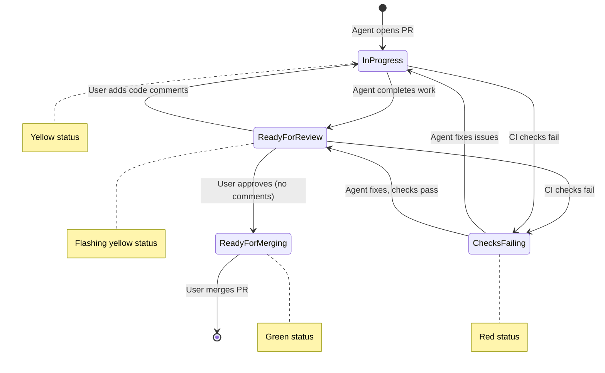

# TreeAgent Development Roadmap

This document outlines the development roadmap for the Pull Request Workflow feature.

## Overview

TreeAgent manages past, present, and future pull requests in a unified workflow. Past and present PRs form a single chain on the main branch, while future changes branch into a tree structure. As PRs are merged, parallel branches are "zipped" back into the trunk through automatic rebasing.

---

## Pull Request Workflow

### Time Dimension

Each pull request is assigned an integer time value `t`:
- `t < 0`: Past (merged/closed) PRs, ordered by merge time
- `t = 0`: Most recently merged PR (head of main)
- `t = 1`: Current open PRs (may be multiple, parallel branches)
- `t > 1`: Future planned changes (stored in ROADMAP.json)

### Current PR Status Workflow



### Status Definitions

| Status | Color | Description |
|--------|-------|-------------|
| In Progress | Yellow | Agent is actively working on the PR |
| Ready for Review | Flashing Yellow | Agent completed, awaiting user review |
| Checks Failing | Red | CI/CD checks have failed |
| Ready for Merging | Green | Approved and ready to merge |
| Merged | Purple | PR has been merged (past) |
| Closed | Red | PR was closed without merging (past) |

---

## ROADMAP.json Schema

Future changes are stored in a `ROADMAP.json` file on the default branch. This schema defines the structure:

```json
{
  "$schema": "http://json-schema.org/draft-07/schema#",
  "title": "TreeAgent Roadmap",
  "type": "object",
  "properties": {
    "version": {
      "type": "string",
      "description": "Schema version"
    },
    "lastUpdated": {
      "type": "string",
      "format": "date-time",
      "description": "ISO 8601 timestamp of last update"
    },
    "changes": {
      "type": "array",
      "items": {
        "$ref": "#/definitions/futureChange"
      }
    }
  },
  "required": ["version", "changes"],
  "definitions": {
    "futureChange": {
      "type": "object",
      "properties": {
        "id": {
          "type": "string",
          "pattern": "^[a-z0-9-]+$",
          "description": "Short identifier for the change (used in branch naming)"
        },
        "group": {
          "type": "string",
          "description": "Project/component group this change belongs to"
        },
        "type": {
          "type": "string",
          "enum": ["feature", "bug", "refactor", "docs", "test", "chore"],
          "description": "Type of change"
        },
        "title": {
          "type": "string",
          "description": "Short title describing the change"
        },
        "description": {
          "type": "string",
          "description": "Detailed description of the change"
        },
        "instructions": {
          "type": "string",
          "description": "Implementation instructions for agents (more specific for lower t values)"
        },
        "t": {
          "type": "integer",
          "minimum": 2,
          "description": "Time position (must be >= 2 for future changes)"
        },
        "parentId": {
          "type": ["string", "null"],
          "description": "ID of parent change (null for root-level changes based on t=1)"
        },
        "thread": {
          "type": "string",
          "description": "Thread name linking related changes across the tree"
        },
        "priority": {
          "type": "string",
          "enum": ["high", "medium", "low"],
          "description": "Priority level"
        },
        "estimatedComplexity": {
          "type": "string",
          "enum": ["small", "medium", "large"],
          "description": "Estimated implementation complexity"
        }
      },
      "required": ["id", "group", "type", "title", "t", "thread"]
    }
  }
}
```

### Branch Naming Convention

Branches follow the pattern: `{group}/{type}/{id}`

Examples:
- `core/feature/pr-time-dimension`
- `web/bug/fix-status-colors`
- `services/refactor/github-sync`

---

## Implementation Plan

This implementation follows TDD principles: write failing tests first, then implement to make them pass.

### Phase 1: Data Model and Schema

#### 1.1 Define PullRequestState Entity

**Tests:**
- `PullRequestState_HasRequiredProperties_TimeGroupTypeId`
- `PullRequestState_TimeValue_CanBeNegativeZeroOrPositive`
- `PullRequestState_Status_MapsToCorrectColors`

**Implementation:**
- Create `PullRequestState` entity with properties: `Id`, `Time`, `Group`, `Type`, `Title`, `Status`, `Thread`, `GitHubPrNumber`
- Add `PullRequestStatus` enum: `InProgress`, `ReadyForReview`, `ChecksFailing`, `ReadyForMerging`, `Merged`, `Closed`
- Add EF Core migration

#### 1.2 Create ROADMAP.json Parser

**Tests:**
- `RoadmapParser_ValidJson_ParsesAllChanges`
- `RoadmapParser_InvalidJson_ThrowsValidationException`
- `RoadmapParser_MissingRequiredFields_ThrowsValidationException`
- `RoadmapParser_ValidatesTimeGreaterThanOne`

**Implementation:**
- Create `RoadmapChange` model matching schema
- Create `RoadmapParser` service with JSON schema validation
- Add file watcher for ROADMAP.json changes

### Phase 2: GitHub Integration Refactor

#### 2.1 Past PR Synchronization

**Tests:**
- `GitHubSync_MergedPRs_AssignsNegativeTimeInOrder`
- `GitHubSync_ClosedPRs_AssignsNegativeTimeInOrder`
- `GitHubSync_MostRecentMerge_HasTimeZero`
- `GitHubSync_PreservesExistingTimeValues`

**Implementation:**
- Modify `GitHubService` to fetch merged/closed PRs with merge timestamps
- Assign `t` values based on merge order (most recent = 0, older = negative)
- Update sync to preserve existing time values for already-synced PRs

#### 2.2 Current PR Status Tracking

**Tests:**
- `CurrentPR_NewPR_HasInProgressStatus`
- `CurrentPR_AgentComplete_HasReadyForReviewStatus`
- `CurrentPR_ReviewComments_ReturnsToInProgress`
- `CurrentPR_ChecksFailing_HasChecksFailing Status`
- `CurrentPR_Approved_HasReadyForMergingStatus`
- `CurrentPR_AllCurrentPRs_HaveTimeOne`

**Implementation:**
- Track PR review state from GitHub webhooks or polling
- Detect CI check status via GitHub API
- Implement status transition logic matching the state diagram
- Ensure all open PRs maintain `t = 1`

#### 2.3 Automatic Rebasing

**Tests:**
- `AutoRebase_OnMerge_RebasesAllOpenPRs`
- `AutoRebase_ConflictDetected_ReportsConflict`
- `AutoRebase_Success_UpdatesAllBranches`

**Implementation:**
- Detect when a PR is merged (t=1 -> t=0)
- Trigger rebase of all other t=1 branches onto new main HEAD
- Handle rebase conflicts with user notification
- Update GitHub branches after successful rebase

### Phase 3: Future Changes (ROADMAP.json)

#### 3.1 Read and Display Future Changes

**Tests:**
- `FutureChanges_LoadFromRoadmap_DisplaysInTree`
- `FutureChanges_ParentChild_DisplaysHierarchy`
- `FutureChanges_Thread_GroupsRelatedChanges`
- `FutureChanges_TimeOrdering_DisplaysCorrectDepth`

**Implementation:**
- Load ROADMAP.json on startup and file change
- Display future changes in feature tree with parent-child relationships
- Show thread information for related changes
- Order by `t` value within siblings

#### 3.2 Promote Future Change to Current PR

**Tests:**
- `PromoteChange_CreatesWorktree_WithCorrectBranchName`
- `PromoteChange_CreatesPR_WithChangeDetails`
- `PromoteChange_RemovesFromRoadmap_AddsToCurrentPRs`
- `PromoteChange_UpdatesChildParents_ToNewPR`

**Implementation:**
- When agent starts work on a future change, create worktree with branch `{group}/{type}/{id}`
- Open PR with title and description from the change
- Remove the change from ROADMAP.json (requires plan-update PR if only plan changes)
- Update any child changes to reference the new PR as parent

#### 3.3 Plan Update PRs

**Tests:**
- `PlanUpdate_OnlyRoadmapChanges_CreatesSpecialThread`
- `PlanUpdate_MustMergeFirst_BeforeOtherPRs`
- `PlanUpdate_ValidatesSchema_BeforeMerge`

**Implementation:**
- Detect PRs that only modify ROADMAP.json
- Assign to special `plan-update` thread
- Block merging of other PRs until plan-update PRs are merged
- Validate ROADMAP.json schema on PR creation

### Phase 4: UI Updates

#### 4.1 Timeline Visualization

**Tests:**
- `Timeline_PastPRs_ShowsMergeOrder`
- `Timeline_CurrentPRs_ShowsParallelBranches`
- `Timeline_FutureChnges_ShowsTree`
- `Timeline_StatusColors_MatchDefinitions`

**Implementation:**
- Redesign feature tree to show time dimension
- Add visual distinction between past (linear), current (parallel), future (tree)
- Apply correct status colors per the status definitions table

#### 4.2 Thread Visualization

**Tests:**
- `Threads_RelatedPRs_ShowsConnection`
- `Threads_CrossTimespan_LinksAllStages`
- `Threads_FilterByThread_ShowsOnlyRelated`

**Implementation:**
- Add visual thread indicators connecting related PRs/changes
- Allow filtering the view by thread
- Show thread timeline spanning past -> current -> future

#### 4.3 Status Workflow UI

**Tests:**
- `StatusUI_InProgress_ShowsYellow`
- `StatusUI_ReadyForReview_ShowsFlashingYellow`
- `StatusUI_ChecksFailing_ShowsRed`
- `StatusUI_ReadyForMerging_ShowsGreen`

**Implementation:**
- Add flashing animation for Ready for Review status
- Update color scheme to match status definitions
- Add status transition buttons where applicable

### Phase 5: Agent Integration

#### 5.1 Agent Status Updates

**Tests:**
- `Agent_StartWork_PRMovesToInProgress`
- `Agent_CompleteWork_PRMovesToReadyForReview`
- `Agent_RoadmapUpdate_CreatesplanUpdatePR`

**Implementation:**
- Agent lifecycle updates PR status automatically
- Detect agent completion and transition to Ready for Review
- When agent modifies ROADMAP.json, create special plan-update PR

#### 5.2 Review Comment Handling

**Tests:**
- `ReviewComments_Received_SpawnsNewAgent`
- `ReviewComments_Agent_MovesToInProgress`
- `ReviewComments_Resolved_MovesToReadyForReview`

**Implementation:**
- Detect new review comments on Ready for Review PRs
- Spawn new agent to address comments
- Track comment resolution status

---

## Future Considerations

Features for potential future development, organized by priority:

### High Priority

- **Interactive Tree Editing**: Drag-and-drop reordering and reparenting of features in the tree view
- **Agent Collaboration**: Enable multiple agents to work on related features with shared context
- **Auto-merge Pipeline**: Automated PR merging with conflict resolution and CI integration

### Medium Priority

- **Code Review Integration**: AI-assisted code review workflow with inline comments and suggestions
- **Metrics Dashboard**: Development velocity tracking, agent performance metrics, and cost analysis
- **Multi-user Support**: Team features with role-based access control and user authentication
- **Notification System**: Email/Slack notifications for agent completions, PR status changes, and errors

### Exploratory

- **Protocol Layer (ACP/AG-UI/MCP)**: Standardized protocols for agent interoperability with other AI tools
- **Plugin Architecture**: Extensibility for custom integrations and workflows
- **Mobile Companion App**: Monitor agents and approve PRs from mobile devices
- **Self-hosting Guide**: Docker/Kubernetes deployment documentation

---

## Contributing

Contributions are welcome. Please see the [SPECIFICATION.md](SPECIFICATION.md) for technical details and architecture overview before submitting pull requests.
